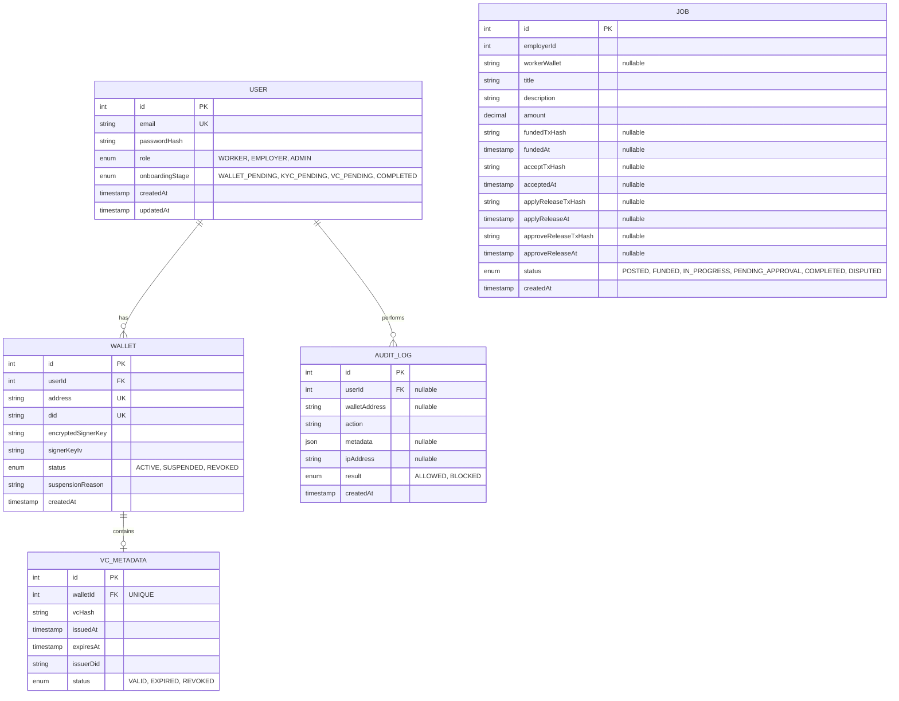

# fr33

A blueprint for compliance-aware business-to-consumer blockchain payments in Singapore, using a freelance marketplace model (e.g. Upwork) as a demonstration.

## Solution Architecture

### System Architecture

```mermaid
graph TB
    subgraph "Presentation Layer"
        WEB[Web Application<br/>Next.js + React]
    end

    subgraph "Application Layer"
        WALLET[Wallet Abstraction Service<br/>(Alchemy)]
        AUTH[Authentication Service<br/>NextAuth]
        API[API Gateway<br/>Next.js API Routes]
        JOB[Job Management Service<br/>PostgreSQL]
        MONITOR[Transaction Monitor<br/>AML/CFT Rules Engine]
    end

    subgraph "Compliance Layer"
        SINGPASS[Singpass OAuth<br/>Mock/Production]
        COMPLIANCE[Compliance Microservice<br/>VC Issuer & Verifier]
        AUDIT[Audit Database<br/>PostgreSQL]
        REPORTING[Regulatory Reporting<br/>STR Generation]
    end

    subgraph "Blockchain Layer"
        BUNDLER[Bundler<br/>(Alchemy)]
        PAYMASTER[Paymaster for Gas Sponsorship (Alchemy)]
        ESCROW[JobEscrow Contract<br/>Solidity]
        POLYGON[Polygon PoS Chain<br/>Layer 2 Network]
        VCREGISTRY[VcRegistry Contract<br/>Solidity]
    end

    subgraph "External Systems"
        MAS[MAS Reporting Portal]
        OFFRAMP[Fiat Off-Ramp<br/>Xfers/Transak]
    end

    subgraph "Data Layer"
        USER[User Table]
        WALLET[Wallet Table]
        AUDITLOG[Audit Log Table]
        VCMETADATA[VC Metadata Table]
        JOB
    end

    WEB --> API
    MOBILE --> API

    API --> AUTH
    API --> JOB
    API --> WALLET
    API --> MONITOR

    AUTH --> SINGPASS
    WALLET --> COMPLIANCE
    MONITOR --> AUDIT
    MONITOR --> REPORTING

    WALLET --> BUNDLER
    BUNDLER --> PAYMASTER
    BUNDLER --> POLYGON

    ESCROW --> POLYGON

    COMPLIANCE --> AUDIT
    REPORTING --> MAS
    WALLET --> OFFRAMP

    COMPLIANCE -.issues VC.-> VCREGISTRY
    JOB -.validates VC.-> VCMETADATA
    JOB -.validates VC.-> VCREGISTRY

    USER -.has.-> WALLET
    USER -.performs.-> AUDITLOG
    WALLET -.has.-> VCMETADATA

    style POLYGON fill:#8b5cf6
    style ESCROW fill:#8b5cf6
    style COMPLIANCE fill:#f59e0b
    style SINGPASS fill:#f59e0b
    style BUNDLER fill:#3b82f6
    style PAYMASTER fill:#3b82f6
```

1. **Main Application Backend (Next.js Full-Stack Application)**

   Handles user authentication, job marketplace logic, escrow orchestration, and interaction with blockchain infrastructure.

2. **Compliance Microservice**

   Acts as a trusted issuer and verifier of VCs, handling KYC verification, credential issuance, verification, and revocation logic. Also deploys the cryptographic anchor of the VC on chain for the main service to perform validation.

3. **Blockchain Layer**

   Holds the smart contracts that are deployed on a Ethereum-compatible network to manage escrow payments, as well as Account Abstraction infrastructure for smart wallet execution.

4. **External Trust and Infrastructure Services**

   Includes mocked SingPass microservice and blockchain node providers (e.g. Alchemy).

### Database Design

#### Main Service (app_service schema)



1. **User table**

   Handles authentication and authorisation, and identity in the application layer.

2. **Wallet table**

   Handles the smart wallet created in accordance to ERC-4337 Account Abstraction.

3. **VC Metadata table**

   Handles the KYC verification of a user, and the storage of issued Verifiable Credentials (VCs). Checks for the expiration/revocation of a VC.

4. **Job table**

   Handles jobs created by employers, including on-chain funding metadata (`fundedTxHash`, `fundedAt`) and status lifecycle.

5. **Audit Log table**

   Stores each action performed by a specific user.

## Setup

### Prerequisites:

1. Node v22.20.0

```sh
# For macOS or Linux users
curl -o- https://raw.githubusercontent.com/nvm-sh/nvm/v0.40.3/install.sh | bash
nvm install 22
nvm use 22
```

2. Hardhat v3 with Ethers.js integration and Mocha testing framework

```sh
npm install --save-dev hardhat
```

3. Solidity 0.8.28

### Steps to Set Up the Project:

1. Clone the repository:

```sh
git clone https://github.com/neozhixuan/fr33.git
```

2. Install dependencies:

```sh
# This installs dependencies from all folders' (FE, BE and Blockchain) package.json due to the "workspaces" field in package.json and compiles it to a single node_modules/
# Install all dependencies (root + all workspaces)
npm install

# Build everything
npm run build
```

3. Set up your environment variables:

   - Create a `.env` file in the root directory.
   - Add your Polygon testnet RPC URL and private key:
     ```
     POLYGON_RPC_URL=your_polygon_amoy_rpc_url
     PRIVATE_KEY=your_private_key
     ```

4. Set up the database:

   - Create a PostgreSQL database.
   - Update the `.env` file with your database connection string:
     ```
     POSTGRES_URL=your_postgres_connection_string
     ```

5. Set up Prisma:

   - Run Prisma migrations to set up the database schema:
     ```sh
     npx prisma migrate dev
     ```

6. Run everything

```sh
# Ensure that postgres is alive. My postgres username is `postgres`
psql -U postgres

# Test everything
npm run test

# Work on specific parts
npm run dev:main
```

## Debugging issues

You can remove `node_modules` and reinstall necessary libraries in case of conflicting dependencies:

```sh
rm -rf node_modules package-lock.json
npm install
```

Transactions may revert with 400 even before hitting the paymaster; this means that our code itself is the issue, and calling the contract would fail. Possibilities:

    - Cannot reach the contract from Alchemy Smart Wallet; deploy your escrow contract online
    - Gas policy set to the wrong network
    - Insufficient POL in the smart account

```sh
Details: {"code":-32521,"message":"execution reverted","data":{"revertData":"0x"}}
```

Unable to send transactions on Metamask

- Reset the nonce data

## Notes

The following libraries primarily work on React 18 instead of 19, and are installed using legacy-peer-deps:

- @alchemy/aa-core
- @alchemy/aa-alchemy
- viem
