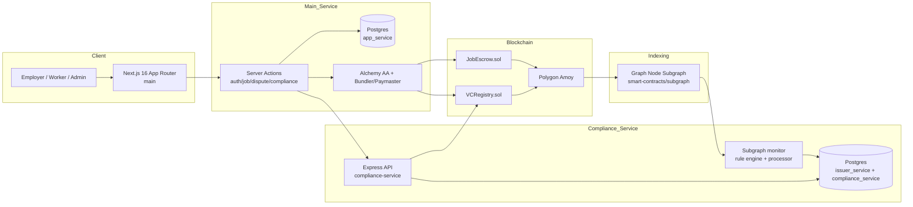
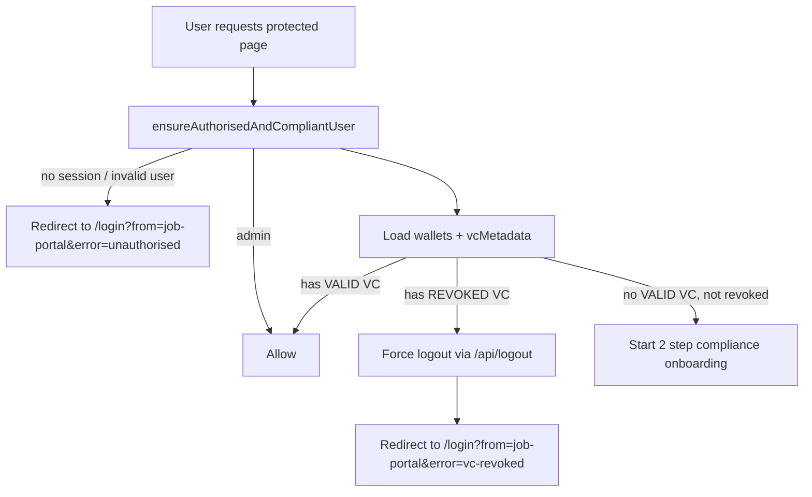
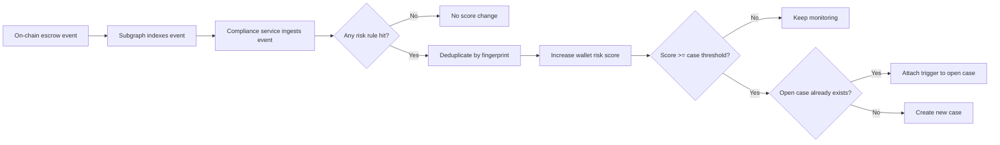
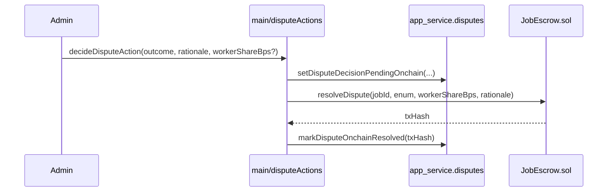
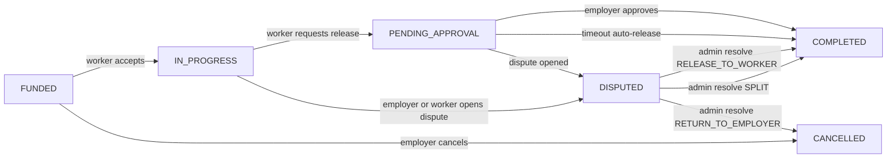
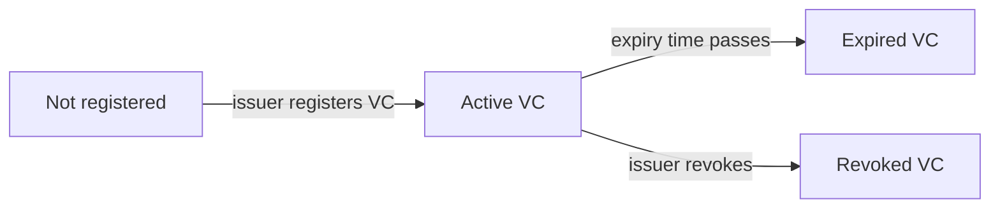
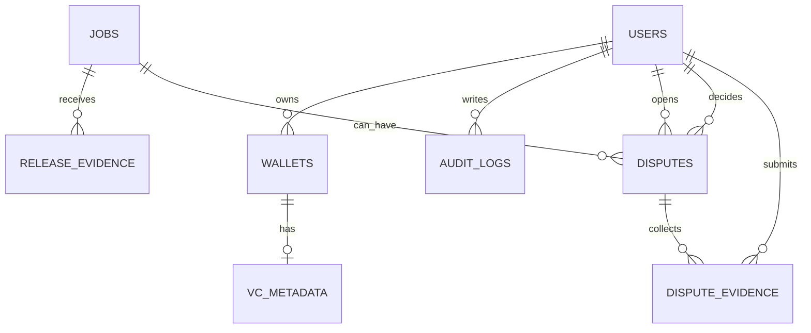
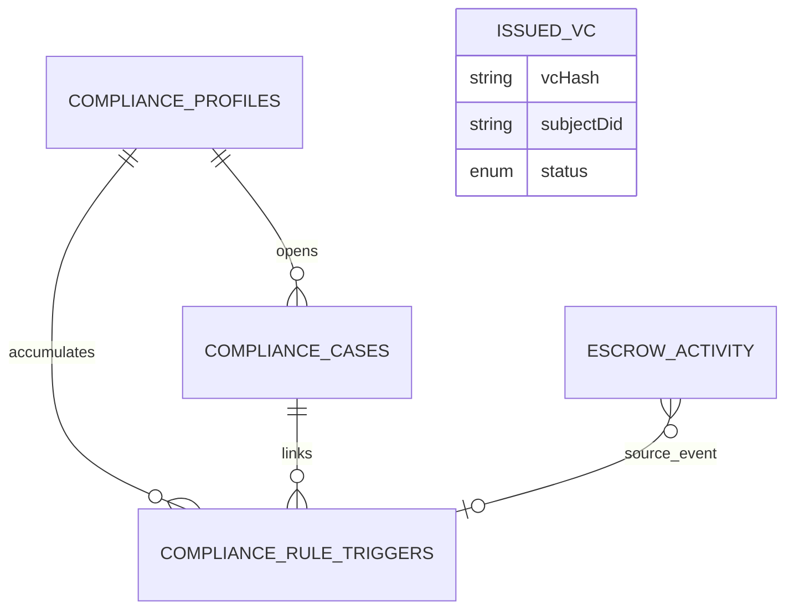

# fr33: A Hybrid Compliance-Aware Architecture for Conditional Escrow Payments in Regulated Service Platforms

A compliance-aware freelance escrow protocol (Singapore-focused demonstrator) built as a monorepo:

- `main`: Next.js app (UI + server actions + Prisma for `app_service`)
- `compliance-service`: Express + Prisma microservice (`issuer_service`, `compliance_service`)
- `smart-contracts`: Hardhat contracts (`JobEscrow`, `VCRegistry`) + subgraph package

## Abstract

Regulated service platforms like Upwork liaise freelancers with employers. These platforms require strong identity verification and transaction monitoring, but use an opaque and custodial escrow to orchestrate payments to users. This project proposes and implements “FR33”, a hybrid Web2-Web3 architecture for conditional escrow payments that preserves on-chain auditability, while enforcing identity-based access for critical payment logic. It combines various components: (i) off-chain identity verification that uses existing identity infrastructure, (ii) an on-chain registry that manages credential-based access control, (iii) a state-machine-based smart contract that enforces escrow payments, and (iv) an off-chain event indexing and rule-based monitoring layer that intervenes in suspicious transactions. These components are demonstrated via a prototype freelance marketplace that aligns with Singapore’s regulatory context. The prototype is evaluated via its functional correctness, where 11 unit and cross-layer test suites cover these workflows. At the same time, its cost of operation is evaluated by benchmarking gas usage across 30 executions of escrow operations on the Polygon Amoy testnet. Finally, the operational trade-offs introduced by the hybrid architecture were evaluated qualitatively against fully on-chain escrows. Experimental results on the network show that the escrow lifecycle incurs an average on-chain cost between $0.006 and $0.013 USD, which is more efficient and consistent than fees charged by centralised platforms for settling payments. These results illustrate the feasibility of the design for a proof-of-concept (PoC) system, by depicting the tradeoffs between performance and trust assumptions.

## System Architecture


```mermaid
graph LR
    subgraph Client
      U[Employer / Worker / Admin]
      UI[Next.js 16 App Router\nmain]
    end

    subgraph Main_Service
      SA[Server Actions\nauth/job/dispute/compliance]
      DB[(Postgres\napp_service)]
      AA[Alchemy AA + Bundler/Paymaster]
    end

    subgraph Compliance_Service
      CS[Express API\ncompliance-service]
      CDB[(Postgres\nissuer_service + compliance_service)]
      MON[Subgraph monitor\nrule engine + processor]
    end

    subgraph Blockchain
      ESC[JobEscrow.sol]
      VCR[VCRegistry.sol]
      AMOY[Polygon Amoy]
    end

    subgraph Indexing
      SG[Graph Node Subgraph\nsmart-contracts/subgraph]
    end

    U --> UI
    UI --> SA
    SA --> DB
    SA --> CS
    SA --> AA
    AA --> ESC
    AA --> VCR
    ESC --> AMOY
    VCR --> AMOY
    AMOY --> SG
    SG --> MON
    MON --> CDB
    CS --> CDB
    CS --> VCR
```

### Core workflows

#### Compliance gate + revoked VC handling


```mermaid
flowchart TD
    A[User requests protected page] --> B[ensureAuthorisedAndCompliantUser]
    B -->|no session / invalid user| L[Redirect to /login?from=job-portal&error=unauthorised]
    B -->|admin| OK[Allow]
    B --> C[Load wallets + vcMetadata]
    C -->|has REVOKED VC| R[Force logout via /api/logout]
    R --> RL[Redirect to /login?from=job-portal&error=vc-revoked]
    C -->|no VALID VC, not revoked| K[Start 2 step compliance onboarding]
    C -->|has VALID VC| OK
```

#### Compliance monitoring and case creation


```mermaid
flowchart LR
  E[On-chain escrow event] --> SG[Subgraph indexes event]
  SG --> ING[Compliance service ingests event]
  ING --> RULES{Any risk rule hit?}
  RULES -->|No| END1[No score change]
  RULES -->|Yes| FP[Deduplicate by fingerprint]
  FP --> SCORE[Increase wallet risk score]
  SCORE --> TH{Score >= case threshold?}
  TH -->|No| END2[Keep monitoring]
  TH -->|Yes| OC{Open case already exists?}
  OC -->|Yes| ATTACH[Attach trigger to open case]
  OC -->|No| OPEN[Create new case]
```

- Every escrow event is watched.
- Each event is tested against 3 risk rules.
- If no rules fire, nothing happens.
- If rules fire, the wallet's risk score goes up.
- When score gets high enough, a case is opened (or updated if one is already open).

Current deterministic rules:

- `LARGE_ESCROW_ANOMALY`
- `HIGH_DISPUTE_FREQUENCY`
- `BURST_ACTIVITY`

#### Dispute resolution process (on-chain + off-chain)


```mermaid
sequenceDiagram
    participant Admin
    participant Main as main/disputeActions
    participant DB as app_service.disputes
    participant Escrow as JobEscrow.sol

    Admin->>Main: decideDisputeAction(outcome, rationale, workerShareBps?)
    Main->>DB: setDisputeDecisionPendingOnchain(...)
    Main->>Escrow: resolveDispute(jobId, enum, workerShareBps, rationale)
    Escrow-->>Main: txHash
    Main->>DB: markDisputeOnchainResolved(txHash)
```

What is committed on-chain:

- outcome (as an enumeration)
- split basis points [optional]
- rationale of this decision
- payout amounts and resolution event

What is persisted off-chain:

- state of the current dispute
- evidences submitted by both parties
- audit logs

### Smart contracts

#### 1) `JobEscrow.sol` state flow


```mermaid
flowchart LR
  FUNDED -->|worker accepts| IN_PROGRESS
  FUNDED -->|employer cancels| CANCELLED

  IN_PROGRESS -->|worker requests release| PENDING_APPROVAL
  IN_PROGRESS -->|employer or worker opens dispute| DISPUTED

  PENDING_APPROVAL -->|employer approves| COMPLETED
  PENDING_APPROVAL -->|timeout auto-release| COMPLETED
  PENDING_APPROVAL -->|dispute opened| DISPUTED

  DISPUTED -->|admin resolve RELEASE_TO_WORKER| COMPLETED
  DISPUTED -->|admin resolve SPLIT| COMPLETED
  DISPUTED -->|admin resolve RETURN_TO_EMPLOYER| CANCELLED
```

#### 2) `VCRegistry.sol` credential lifecycle


```mermaid
flowchart LR
  NEW[Not registered] -->|issuer registers VC| ACTIVE[Active VC]
  ACTIVE -->|expiry time passes| EXPIRED[Expired VC]
  ACTIVE -->|issuer revokes| REVOKED[Revoked VC]
```

Rule used by app/compliance checks:

- valid VC = exists + correct subject + not revoked + not expired

### Trust model

#### What is trust-minimized (on-chain guarantees)

- Escrow money movement and dispute payout logic in `JobEscrow.sol`
- VC revocation/validity flags in `VCRegistry.sol`
- Anyone can verify these from chain state/events

#### What is trusted infrastructure (off-chain)

- Main app database (`app_service`) for users, jobs mirror, disputes, evidence, audit logs
- Compliance service for monitoring, rule evaluation, score computation, case management
- Subgraph/indexer freshness and uptime

#### Human/admin trust assumptions

- Admin can resolve disputes and choose rationale/split
- Authorised issuer can issue/revoke VCs
- These are visible/auditable, but still privileged roles

#### Practical takeaway

- Money custody + final payout rules are enforced by smart contracts
- Product UX, compliance workflows, and evidence handling are off-chain service logic

### Data model snapshot

#### Main service schema (`app_service`) — simplified ER


```mermaid
erDiagram
    USERS ||--o{ WALLETS : owns
    WALLETS ||--o| VC_METADATA : has
    USERS ||--o{ AUDIT_LOGS : writes

    JOBS ||--o{ RELEASE_EVIDENCE : receives
    JOBS ||--o{ DISPUTES : can_have

    USERS ||--o{ DISPUTES : opens
    USERS ||--o{ DISPUTES : decides
    DISPUTES ||--o{ DISPUTE_EVIDENCE : collects
    USERS ||--o{ DISPUTE_EVIDENCE : submits
```

Core tables:

- `users`, `wallets`, `vc_metadata`
- `jobs`
- `disputes`, `dispute_evidence`
- `release_evidence`
- `audit_logs`

#### Compliance service schemas — simplified ER


```mermaid
erDiagram
    COMPLIANCE_PROFILES ||--o{ COMPLIANCE_RULE_TRIGGERS : accumulates
    COMPLIANCE_PROFILES ||--o{ COMPLIANCE_CASES : opens
    COMPLIANCE_CASES ||--o{ COMPLIANCE_RULE_TRIGGERS : links
    ESCROW_ACTIVITY }o--o| COMPLIANCE_RULE_TRIGGERS : source_event

    ISSUED_VC {
      string vcHash
      string subjectDid
      enum status
    }
```

Schemas:

- `issuer_service`: `issued_vc` (+ `VCStatus`)
- `compliance_service`: `escrow_activity`, `compliance_profiles`, `compliance_rule_triggers`, `compliance_cases`

## Setup

### Prerequisites

1. Node.js 22.x
2. Docker Desktop (for local Graph Node + IPFS)
3. PostgreSQL running locally
4. Polygon Amoy RPC URL (Alchemy/Infura/etc)

### 1) Clone + install

```sh
git clone https://github.com/neozhixuan/fr33.git
cd fr33
npm install
```

### 2) Configure environment files

#### Main service

1. Copy [main/.env.example](main/.env.example) to `main/.env`
2. Fill at minimum:

   - `NEXT_POSTGRES_URL`
   - `NEXT_RPC_URL`
   - `NEXT_ESCROW_CONTRACT_ADDRESS`
   - `NEXT_VC_REGISTRY_ADDRESS`
   - Alchemy values (`NEXT_ALCHEMY_API_KEY`, `NEXT_ALCHEMY_GAS_POLICY_ID`)

- Embedded wallet public values (`NEXT_PUBLIC_ALCHEMY_API_KEY`, `NEXT_PUBLIC_ALCHEMY_GAS_POLICY_ID`)

Optional (worker evidence image upload):

- `CLOUDINARY_CLOUD_NAME`
- `CLOUDINARY_API_KEY`
- `CLOUDINARY_API_SECRET`
- `CLOUDINARY_EVIDENCE_FOLDER`

#### Compliance service

1. Copy [compliance-service/.env.example](compliance-service/.env.example) to `compliance-service/.env`
2. Fill at minimum:
   - `POSTGRES_URL`
   - `RPC_URL`
   - `VC_REGISTRY_ADDRESS`
   - `ISSUER_PRIVATE_KEY`
   - `VC_SIGNING_PRIVATE_KEY`
   - `COMPLIANCE_SUBGRAPH_URL=http://127.0.0.1:8000/subgraphs/name/fr33/job-escrow`

#### Subgraph

1. Copy [smart-contracts/subgraph/.env.example](smart-contracts/subgraph/.env.example) to `smart-contracts/subgraph/.env`
2. Fill:
   - `POLYGON_AMOY_RPC_URL`

### 3) Deploy contracts (Amoy)

From [smart-contracts](smart-contracts):

```sh
npm run build
npm run deploy:polygonAmoy
```

Then copy deployed addresses from [smart-contracts/ignition/deployments/chain-80002/deployed_addresses.json](smart-contracts/ignition/deployments/chain-80002/deployed_addresses.json) into:

- `NEXT_ESCROW_CONTRACT_ADDRESS` (main)
- `NEXT_VC_REGISTRY_ADDRESS` (main)
- `VC_REGISTRY_ADDRESS` (compliance-service)
- `subgraph.yaml` (compliance-service)

### 4) Set up Prisma schemas (both services)

From repo root:

```sh
cd main
npm run prisma-setup
cd ../compliance-service
npm run prisma-setup
cd ..
```

Notes:

- Main service uses schema `app_service`
- Compliance service uses schemas `issuer_service` and `compliance_service`

### 5) Start local subgraph stack + deploy subgraph

From repo root:

```sh
npm run subgraph:stack:up
npm run subgraph:deploy-local
```

What this does:

- Starts local Graph Node + IPFS + subgraph Postgres (Docker)
- Auto-sets subgraph `startBlock` near latest block (demo-friendly)
- Builds and deploys the subgraph

If graph-node fails with DB locale error, run once:

```sh
cd smart-contracts/subgraph
docker compose down -v
npm run stack:up
cd ../..
```

### Optional: seed an admin user (main service)

In `main/.env`, set:

- `ADMIN_USERNAME`
- `ADMIN_PASSWORD`

Then run:

```sh
cd main
npm run prisma:seed
cd ..
```

Notes:

- Login currently validates an email format. If `ADMIN_USERNAME` is not an email, seed maps it to `<username>@gmail.com`.
- Dispute resolution still requires backend access to `NEXT_ADMIN_PRIVATE_KEY` for on-chain admin transactions.

### 6) Start services

Use 2 terminals from repo root:

```sh
# Terminal A
npm run dev:main

# Terminal B
npm run dev:compliance
```

### 7) Smoke checks

1. Subgraph GraphQL endpoint responds:
   - `http://127.0.0.1:8000/subgraphs/name/fr33/job-escrow`
2. Compliance service starts and monitor logs appear
3. Perform escrow actions (fund/cancel/accept/release) and verify events are ingested

## Debugging issues

You can remove `node_modules` and reinstall necessary libraries in case of conflicting dependencies:

```sh
rm -rf node_modules package-lock.json
npm install
```

Transactions may revert with 400 even before hitting the paymaster; this means that our code itself is the issue, and calling the contract would fail. Possibilities:

    - Cannot reach the contract from Alchemy Smart Wallet; deploy your escrow contract online
    - Gas policy set to the wrong network
    - Insufficient POL in the smart account

```sh
Details: {"code":-32521,"message":"execution reverted","data":{"revertData":"0x"}}
```

Unable to send transactions on Metamask

- Reset the nonce data

## Evaluation

### Unit Tests

Functional correctness is tested via unit tests for off-chain services, as well as smart contracts. At the same time, cross-layer validations are performed to ensure that end-to-end workflows operate correctly. 11 suites of tests cover these scopes, and all of them pass consistently.

Cross-layer tests ensure that integration is consistent across multiple services and contracts, and are designed based on standard user paths. For instance, onboarding flows that involve multiple layers are aligned and work accurately across them.

### On-Chain Cost Analysis

| Action            | Avg. Gas Fee (wei) | P95 Gas Fee (wei) | Translated Avg. Fee (USD) | Translated P95 Fee (USD) |
|:------------------|:-------------------|:------------------|:--------------------------|:--------------------------|
| Escrow Creation   | 107,561            | 106,991           | \$0.00430244              | \$0.00427964              |
| Fund Release      | 50,620             | 50,620            | \$0.00202480              | \$0.00202480              |
| Open Dispute      | 59,497             | 59,497            | \$0.00237988              | \$0.00237988              |
| Resolve Dispute   | 150,197            | 150,197           | \$0.00600788              | \$0.00600788              |

The sum of gas fees in a full workflow, depending on the presence of a dispute, would cost between $0.006 and $0.013 USD, assuming a conversion rate of 1 POL to $0.80 USD. Given that gas costs are handled by the paymaster, $1 USD could sponsor roughly 160 lifecycles of escrow operations, which is feasible in the PoC scope. As the job scales up to $100 in value, Upwork would charge a scaled up $15 in service fees, while FR33’s on-chain cost would remain constant as gas costs are independent of escrow amount. 

## Notes

- Compliance portal data sources:

  - Main service `app_service.audit_logs` (application actions)
  - Compliance indexer `compliance_service.escrow_activity` (ingested lifecycle events)

- Admin portal quality-of-life updates now include:

  - repository abstraction for compliance Prisma calls in main service
  - rule label descriptions + trigger explanation summaries in UI
  - sticky tab navigation + account details visibility in case views

- Manual VC revocation now handles both hash formats:

  - `0x` prefixed 32-byte hex
  - bare 64-char hex

- Revoked VC users are force-logged-out and redirected to login with `vc-revoked` error and support contact guidance.

## Future Implementation

- Admin action logging in compliance microservice
