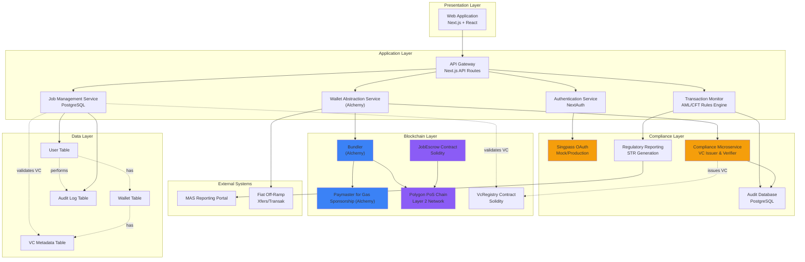
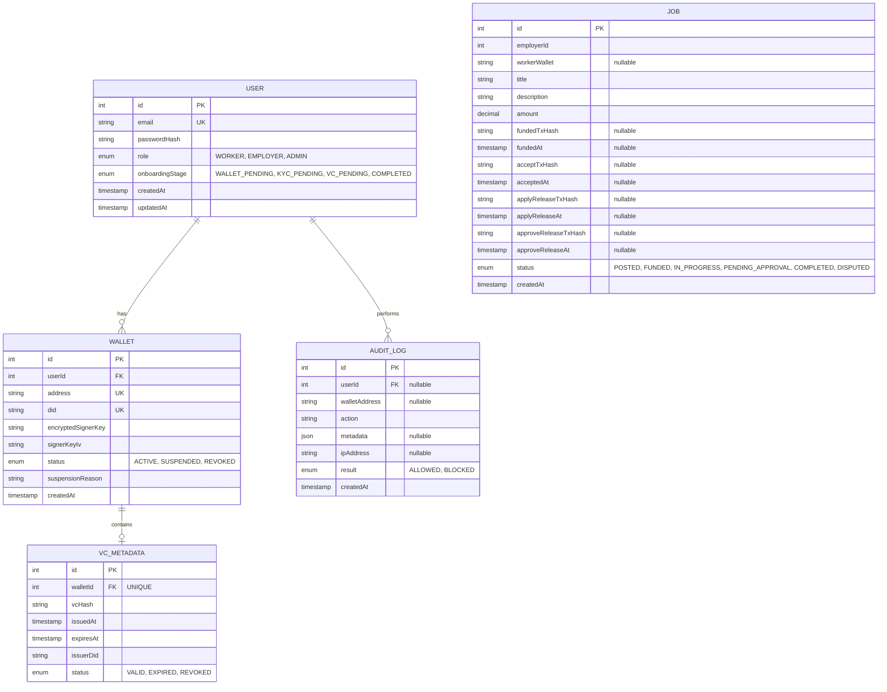

# fr33

A blueprint for compliance-aware business-to-consumer blockchain payments in Singapore, using a freelance marketplace model (e.g. Upwork) as a demonstration.

## Solution Architecture

### System Architecture


```mermaid
graph TB
    subgraph "Presentation Layer"
        WEB["Web Application\nNext.js + React"]
    end

    subgraph "Application Layer"
        WALLET["Wallet Abstraction Service\n(Alchemy)"]
        AUTH["Authentication Service\nNextAuth"]
        API["API Gateway\nNext.js API Routes"]
        JOB["Job Management Service\nPostgreSQL"]
        MONITOR["Transaction Monitor\nAML/CFT Rules Engine"]
    end

    subgraph "Compliance Layer"
        SINGPASS["Singpass OAuth\nMock/Production"]
        COMPLIANCE["Compliance Microservice\nVC Issuer & Verifier"]
        AUDIT["Audit Database\nPostgreSQL"]
        REPORTING["Regulatory Reporting\nSTR Generation"]
    end

    subgraph "Blockchain Layer"
        BUNDLER["Bundler\n(Alchemy)"]
        PAYMASTER["Paymaster for Gas Sponsorship (Alchemy)"]
        ESCROW["JobEscrow Contract\nSolidity"]
        POLYGON["Polygon PoS Chain\nLayer 2 Network"]
        VCREGISTRY["VcRegistry Contract\nSolidity"]
    end

    subgraph "External Systems"
        MAS["MAS Reporting Portal"]
        OFFRAMP["Fiat Off-Ramp\nXfers/Transak"]
    end

    subgraph "Data Layer"
        USER["User Table"]
        WALLETDB["Wallet Table"]
        AUDITLOG["Audit Log Table"]
        VCMETADATA["VC Metadata Table"]
        JOB
    end

    WEB --> API

    API --> AUTH
    API --> JOB
    API --> WALLET
    API --> MONITOR

    AUTH --> SINGPASS
    WALLET --> COMPLIANCE
    MONITOR --> AUDIT
    MONITOR --> REPORTING

    WALLET --> BUNDLER
    BUNDLER --> PAYMASTER
    BUNDLER --> POLYGON

    ESCROW --> POLYGON

    COMPLIANCE --> AUDIT
    REPORTING --> MAS
    WALLET --> OFFRAMP

    COMPLIANCE -.issues VC.-> VCREGISTRY
    JOB -.validates VC.-> VCMETADATA
    JOB -.validates VC.-> VCREGISTRY

    USER -.has.-> WALLETDB
    USER -.performs.-> AUDITLOG
    WALLETDB -.has.-> VCMETADATA

    JOB --> USER
    JOB --> AUDITLOG

    style POLYGON fill:#8b5cf6
    style ESCROW fill:#8b5cf6
    style COMPLIANCE fill:#f59e0b
    style SINGPASS fill:#f59e0b
    style BUNDLER fill:#3b82f6
    style PAYMASTER fill:#3b82f6
```

1. **Main Application Backend (Next.js Full-Stack Application)**

   Handles user authentication, job marketplace logic, escrow orchestration, and interaction with blockchain infrastructure.

2. **Compliance Microservice**

   Acts as a trusted issuer and verifier of VCs, handling KYC verification, credential issuance, verification, and revocation logic. Also deploys the cryptographic anchor of the VC on chain for the main service to perform validation.

3. **Blockchain Layer**

   Holds the smart contracts that are deployed on a Ethereum-compatible network to manage escrow payments, as well as Account Abstraction infrastructure for smart wallet execution.

4. **External Trust and Infrastructure Services**

   Includes mocked SingPass microservice and blockchain node providers (e.g. Alchemy).

### Database Design

#### Main Service (app_service schema)


```mermaid
erDiagram
    USER ||--o{ WALLET : has
    USER ||--o{ AUDIT_LOG : performs
    WALLET ||--o| VC_METADATA : contains

    USER {
        int id PK
        string email UK
        string passwordHash
        enum role "WORKER, EMPLOYER, ADMIN"
        enum onboardingStage "WALLET_PENDING, KYC_PENDING, VC_PENDING, COMPLETED"
        timestamp createdAt
        timestamp updatedAt
    }

    WALLET {
        int id PK
        int userId FK
        string address UK
        string did UK
        string encryptedSignerKey
        string signerKeyIv
        enum status "ACTIVE, SUSPENDED, REVOKED"
        string suspensionReason
        timestamp createdAt
    }

    VC_METADATA {
        int id PK
        int walletId FK "UNIQUE"
        string vcHash
        timestamp issuedAt
        timestamp expiresAt
        string issuerDid
        enum status "VALID, EXPIRED, REVOKED"
    }

    JOB {
        int id PK
        int employerId
        string workerWallet "nullable"
        string title
        string description
        decimal amount
        string fundedTxHash "nullable"
        timestamp fundedAt "nullable"
        string acceptTxHash "nullable"
        timestamp acceptedAt "nullable"
        string applyReleaseTxHash "nullable"
        timestamp applyReleaseAt "nullable"
        string approveReleaseTxHash "nullable"
        timestamp approveReleaseAt "nullable"
        enum status "POSTED, FUNDED, IN_PROGRESS, PENDING_APPROVAL, COMPLETED, DISPUTED"
        timestamp createdAt
    }

    AUDIT_LOG {
        int id PK
        int userId FK "nullable"
        string walletAddress "nullable"
        string action
        json metadata "nullable"
        string ipAddress "nullable"
        enum result "ALLOWED, BLOCKED"
        timestamp createdAt
    }
```

1. **User table**

   Handles authentication and authorisation, and identity in the application layer.

2. **Wallet table**

   Handles the smart wallet created in accordance to ERC-4337 Account Abstraction.

3. **VC Metadata table**

   Handles the KYC verification of a user, and the storage of issued Verifiable Credentials (VCs). Checks for the expiration/revocation of a VC.

4. **Job table**

   Handles jobs created by employers, including on-chain funding metadata (`fundedTxHash`, `fundedAt`) and status lifecycle.

5. **Audit Log table**

   Stores each action performed by a specific user.

### Decentralised Authentication Design

Users will have to register for an account.

- Through the KYC process, a Verifiable Credential transaction is created in the Polygon Amoy testnet for.

Users will then be authenticated upon each gated action.

- The backend will make a call to the smart contract to verify that the Verifiable Credential is not revoked.

## Setup

### Prerequisites

1. Node.js 22.x
2. Docker Desktop (for local Graph Node + IPFS)
3. PostgreSQL running locally
4. Polygon Amoy RPC URL (Alchemy/Infura/etc)

### 1) Clone + install

```sh
git clone https://github.com/neozhixuan/fr33.git
cd fr33
npm install
```

### 2) Configure environment files

#### Main service

1. Copy [main/.env.example](main/.env.example) to `main/.env`
2. Fill at minimum:

   - `NEXT_POSTGRES_URL`
   - `NEXT_RPC_URL`
   - `NEXT_ESCROW_CONTRACT_ADDRESS`
   - `NEXT_VC_REGISTRY_ADDRESS`
   - Alchemy values (`NEXT_ALCHEMY_API_KEY`, `NEXT_ALCHEMY_GAS_POLICY_ID`)

   Optional (worker evidence image upload):

   - `CLOUDINARY_CLOUD_NAME`
   - `CLOUDINARY_API_KEY`
   - `CLOUDINARY_API_SECRET`
   - `CLOUDINARY_EVIDENCE_FOLDER`

#### Compliance service

1. Copy [compliance-service/.env.example](compliance-service/.env.example) to `compliance-service/.env`
2. Fill at minimum:
   - `POSTGRES_URL`
   - `RPC_URL`
   - `VC_REGISTRY_ADDRESS`
   - `ISSUER_PRIVATE_KEY`
   - `VC_SIGNING_PRIVATE_KEY`
   - `COMPLIANCE_SUBGRAPH_URL=http://127.0.0.1:8000/subgraphs/name/fr33/job-escrow`

#### Subgraph

1. Copy [smart-contracts/subgraph/.env.example](smart-contracts/subgraph/.env.example) to `smart-contracts/subgraph/.env`
2. Fill:
   - `POLYGON_AMOY_RPC_URL`

### 3) Deploy contracts (Amoy)

From [smart-contracts](smart-contracts):

```sh
npm run build
npm run deploy:polygonAmoy
```

Then copy deployed addresses from [smart-contracts/ignition/deployments/chain-80002/deployed_addresses.json](smart-contracts/ignition/deployments/chain-80002/deployed_addresses.json) into:

- `NEXT_ESCROW_CONTRACT_ADDRESS` (main)
- `NEXT_VC_REGISTRY_ADDRESS` (main)
- `VC_REGISTRY_ADDRESS` (compliance-service)

### 4) Set up Prisma schemas (both services)

From repo root:

```sh
cd main
npm run prisma-setup
cd ../compliance-service
npm run prisma-setup
cd ..
```

Notes:

- Main service uses schema `app_service`
- Compliance service uses schemas `issuer_service` and `compliance_service`

### 5) Start local subgraph stack + deploy subgraph

From repo root:

```sh
npm run subgraph:stack:up
npm run subgraph:deploy-local
```

What this does:

- Starts local Graph Node + IPFS + subgraph Postgres (Docker)
- Auto-sets subgraph `startBlock` near latest block (demo-friendly)
- Builds and deploys the subgraph

If graph-node fails with DB locale error, run once:

```sh
cd smart-contracts/subgraph
docker compose down -v
npm run stack:up
cd ../..
```

### Optional: seed an admin user (main service)

In `main/.env`, set:

- `ADMIN_USERNAME`
- `ADMIN_PASSWORD`

Then run:

```sh
cd main
npm run prisma:seed
cd ..
```

Notes:

- Login currently validates an email format. If `ADMIN_USERNAME` is not an email, seed maps it to `<username>@gmail.com`.
- Dispute resolution still requires backend access to `NEXT_ADMIN_PRIVATE_KEY` for on-chain admin transactions.

### 6) Start services

Use 2 terminals from repo root:

```sh
# Terminal A
npm run dev:main

# Terminal B
npm run dev:compliance
```

### 7) Smoke checks

1. Subgraph GraphQL endpoint responds:
   - `http://127.0.0.1:8000/subgraphs/name/fr33/job-escrow`
2. Compliance service starts and monitor logs appear
3. Perform escrow actions (fund/cancel/accept/release) and verify events are ingested

## Debugging issues

You can remove `node_modules` and reinstall necessary libraries in case of conflicting dependencies:

```sh
rm -rf node_modules package-lock.json
npm install
```

Transactions may revert with 400 even before hitting the paymaster; this means that our code itself is the issue, and calling the contract would fail. Possibilities:

    - Cannot reach the contract from Alchemy Smart Wallet; deploy your escrow contract online
    - Gas policy set to the wrong network
    - Insufficient POL in the smart account

```sh
Details: {"code":-32521,"message":"execution reverted","data":{"revertData":"0x"}}
```

Unable to send transactions on Metamask

- Reset the nonce data

## Notes

The following libraries primarily work on React 18 instead of 19, and are installed using legacy-peer-deps:

- @alchemy/aa-core
- @alchemy/aa-alchemy
- viem
