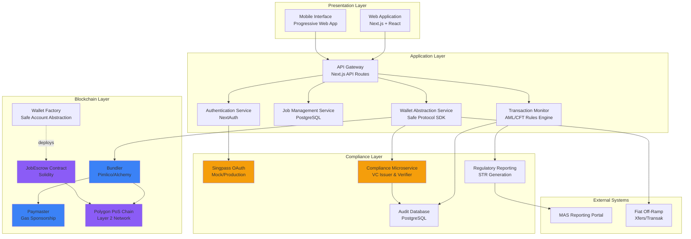
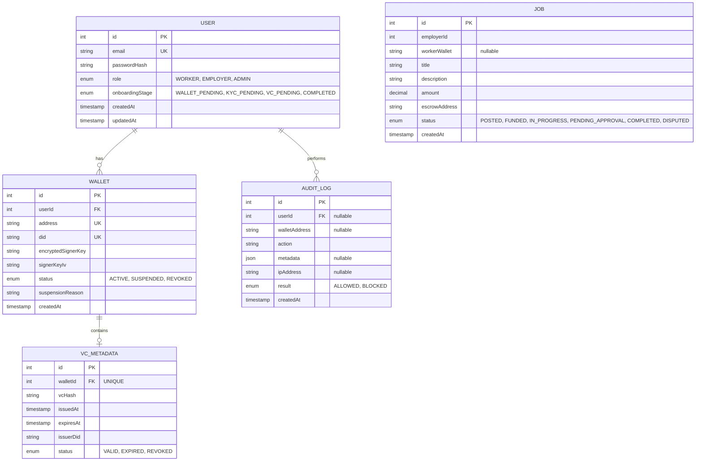
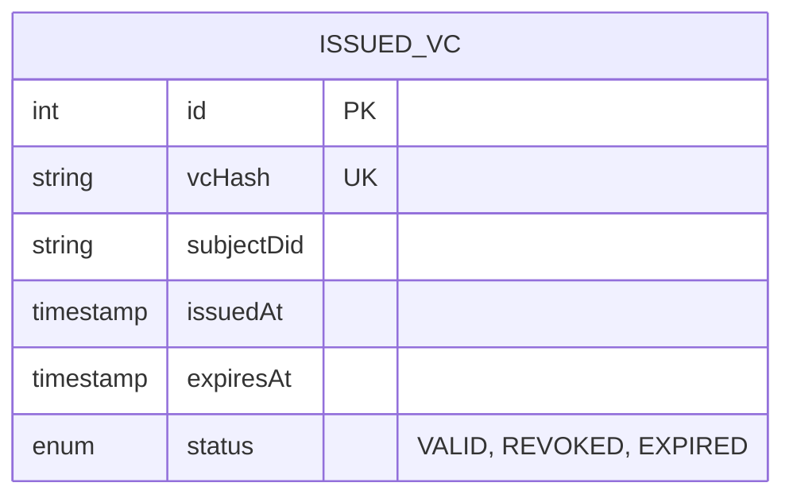

# fr33

A blueprint for compliance-aware business-to-consumer blockchain payments in Singapore, using a freelance marketplace model (e.g. Upwork) as a demonstration.

## Solution Architecture

### System Architecture



1. **Main Application Backend (Next.js Full-Stack Application)**

   Handles user authentication, job marketplace logic, escrow orchestration, and interaction with blockchain infrastructure.

2. **Compliance Microservice**

   Acts as a trusted issuer and verifier of VCs, handling KYC verification, credential issuance, verification, and revocation logic.

3. **Blockchain Layer**

   Holds the smart contracts that are deployed on a Ethereum-compatible network to manage escrow payments, as well as Account Abstraction infrastructure for smart wallet execution.

4. **External Trust and Infrastructure Services**

   Includes mocked SingPass microservice and blockchain node providers (e.g. Alchemy).

### Database Design

#### Main Service (app_service schema)



#### Compliance Microservice (issuer_service schema)



1. **User table**

   Handles authentication and authorisation, and identity in the application layer.

2. **Wallet table**

   Handles the smart wallet created in accordance to ERC-4337 Account Abstraction.

3. **VC Metadata table**

   Handles the KYC verification of a user, and the storage of issued Verifiable Credentials (VCs). Checks for the expiration/revocation of a VC.

4. **Job table**

   Handles the storage of jobs created by employers, along with escrow data.

5. **Audit Log table**

   Stores each action performed by a specific user.

## Setup

### Prerequisites:

1. Node v22.20.0

```sh
# For macOS or Linux users
curl -o- https://raw.githubusercontent.com/nvm-sh/nvm/v0.40.3/install.sh | bash
nvm install 22
nvm use 22
```

2. Hardhat v3 with Ethers.js integration and Mocha testing framework

```sh
npm install --save-dev hardhat
```

3. Solidity 0.8.28

### Steps to Set Up the Project:

1. Clone the repository:

```sh
git clone https://github.com/neozhixuan/fr33.git
```

2. Install dependencies:

```sh
# This installs dependencies from all folders' (FE, BE and Blockchain) package.json due to the "workspaces" field in package.json and compiles it to a single node_modules/
# Install all dependencies (root + all workspaces)
npm install

# Build everything
npm run build
```

3. Set up your environment variables:

   - Create a `.env` file in the root directory.
   - Add your Ethereum Sepolia testnet RPC URL and private key:
     ```
     SEPOLIA_RPC_URL=your_sepolia_rpc_url
     PRIVATE_KEY=your_private_key
     ```

4. Set up the database:

   - Create a PostgreSQL database.
   - Update the `.env` file with your database connection string:
     ```
     POSTGRES_URL=your_postgres_connection_string
     ```

5. Set up Prisma:

   - Run Prisma migrations to set up the database schema:
     ```sh
     npx prisma migrate dev
     ```

6. Run everything

```sh
# Test everything
npm run test

# Work on specific parts
npm run dev:main
```

## Database Setup

Database schema:

```sql
CREATE TABLE IF NOT EXISTS users (
  id SERIAL PRIMARY KEY,
  name TEXT NOT NULL DEFAULT '',
  email TEXT NOT NULL DEFAULT '',
  password TEXT NOT NULL DEFAULT '',
  created_at TIMESTAMPTZ DEFAULT NOW();
);
```

## Debugging issues

You can remove `node_modules` and reinstall necessary libraries in case of conflicting dependencies:

```sh
rm -rf node_modules package-lock.json
npm install
```

## Notes

The following libraries primarily work on React 18 instead of 19, and are installed using legacy-peer-deps:

- @alchemy/aa-core
- @alchemy/aa-alchemy
- viem
