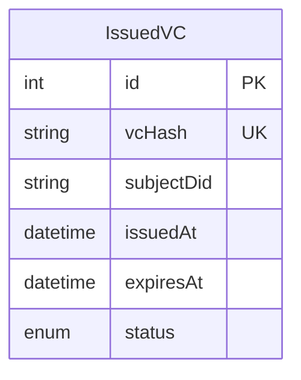
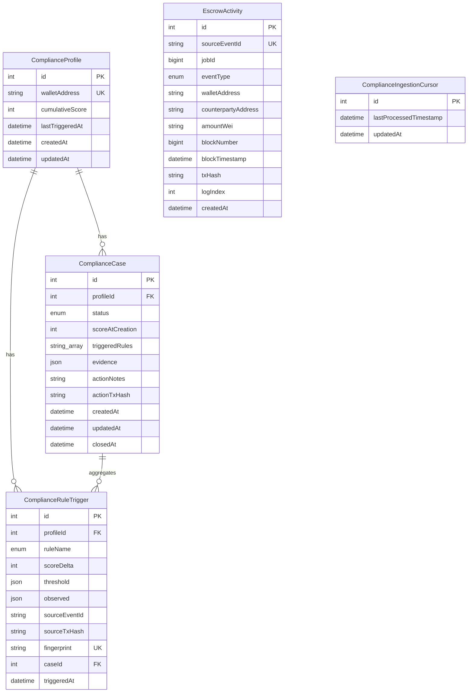

# Schema ER Diagrams

This document contains ER diagrams generated from Prisma schemas in both services:

- main service schema: app_service
- compliance service schemas: issuer_service, compliance_service

## 1) main service — app_service

```mermaid
erDiagram
    User ||--o{ Wallet : owns
    Wallet ||--o| VCMetadata : has
    User ||--o{ AuditLog : writes

    Job ||--o{ ReleaseEvidence : contains
    Job ||--o{ Dispute : has

    User ||--o{ Dispute : opens
    User ||--o{ Dispute : decides

    Dispute ||--o{ DisputeEvidence : contains
    User ||--o{ DisputeEvidence : submits

    User {
        int id PK
        string email UK
        string passwordHash
        enum role
        enum onboardingStage
        datetime createdAt
        datetime updatedAt
    }

    Wallet {
        int id PK
        int userId FK
        string address UK
        string did UK
        string encryptedSignerKey
        string signerKeyIv
        enum status
        string suspensionReason
        datetime createdAt
    }

    VCMetadata {
        int id PK
        int walletId FK UK
        string vcHash
        string txHash
        enum status
        string issuerDid
        string subjectDid
        datetime issuedAt
        datetime expiresAt
        datetime revokedAt
    }

    Job {
        int id PK
        int employerId
        string workerWallet
        string title
        string description
        decimal amount
        string fundedTxHash
        datetime fundedAt
        string acceptTxHash
        datetime acceptedAt
        string applyReleaseTxHash
        datetime applyReleaseAt
        string approveReleaseTxHash
        datetime approveReleaseAt
        enum status
        datetime createdAt
    }

    ReleaseEvidence {
        int id PK
        int jobId FK
        enum type
        string fileUrl
        string notes
        datetime uploadedAt
        int uploadedBy
    }

    AuditLog {
        int id PK
        int userId FK
        string walletAddress
        string action
        json metadata
        string ipAddress
        enum result
        datetime createdAt
    }

    Dispute {
        int id PK
        int jobId FK
        int openedByUserId FK
        enum status
        string freezeTxHash
        string resolutionTxHash
        enum decision
        int workerShareBps
        string decisionReason
        string adminReviewNote
        int decidedByAdminId FK
        datetime openedAt
        datetime decidedAt
        datetime resolvedAt
        datetime cancelledAt
        datetime createdAt
        datetime updatedAt
    }

    DisputeEvidence {
        int id PK
        int disputeId FK
        int submittedByUserId FK
        enum submittedByRole
        enum evidenceType
        string contentText
        string attachmentUrl
        string externalRef
        string idempotencyKey
        datetime createdAt
        datetime updatedAt
    }
```

## 2) compliance service — issuer_service



## 3) compliance service — compliance_service


